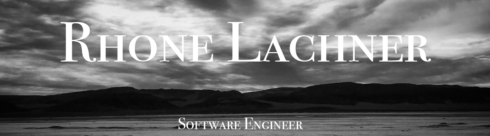

</img>

 
<h2> ⁺ ༚˚✧ Hi, I'm Rhone! Welcome to my GitHub page! ✧˚༚ ⁺ </h2>

   <h4> Creative and innovative problem solver, empathetic team builder, optimist, and communicative collaborator. </h4>

   After several years working within the wellness and medical field I have migrated into Full Stack Software Engineering, and I'm loving it! With a broad skillset, adaptive resilience, and ability to find genuine connection in all places, I look forward to integrating a wholistic approach into the digital world.

   I have 20+ years experience in multi-instrumental music performance and composition, and 10+ years experience in event planning, touring, digital music production, digital photography, and editing. I enjoy incorporating these creative skills into my work whenever I can.

   I believe every business is made better with an inclusive and diverse array of perspectives and backgrounds. Do you agree?

  ▫️ Languages: Javascript, HTML, CSS ▫️  
  ▫️ Front-End: React, Redux ▫️  
  ▫️ Back-End: NodeJs, Express ▫️  
  ▫️ Testing: Jest, QUnit ▫️  
  ▫️ Databases: PostgreSQL ▫️  
  ▫️ Tools: VS Code, Github, Slack, Heroku, Netlify, Postman, pgAdmin, Photoshop, GarageBand, Miro, Whimsical ▫️  

   <h2>
     <a href="https://www.linkedin.com/in/rhonelachner/">LinkedIn</a>
    //
     <a href="https://www.rhonelachner.com">Portfolio Site</a>  
   </h2>

 <h3>
   GitHub Stats:
 </h3>

  
 

  

